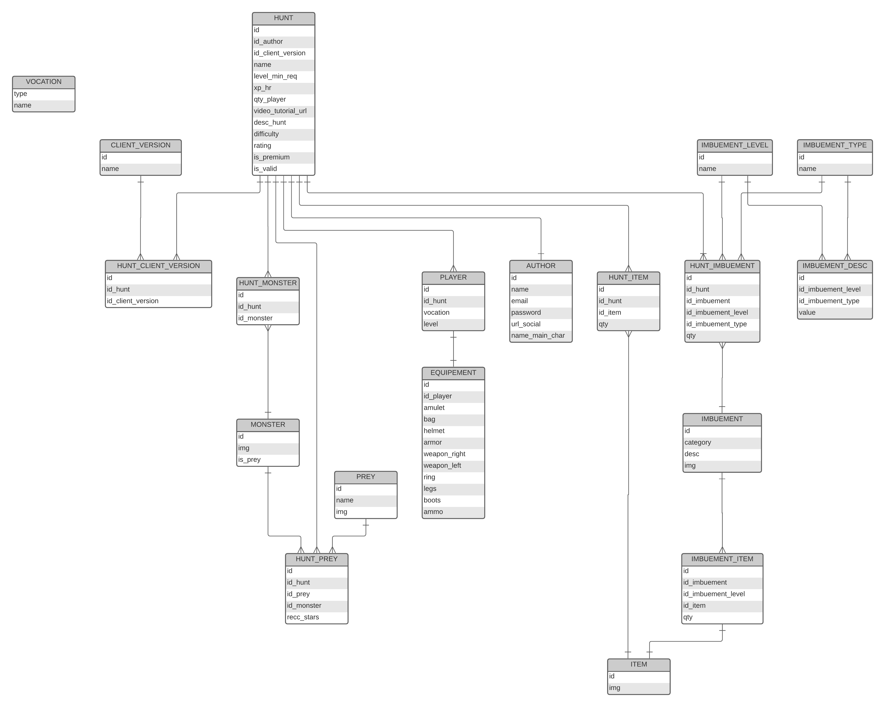
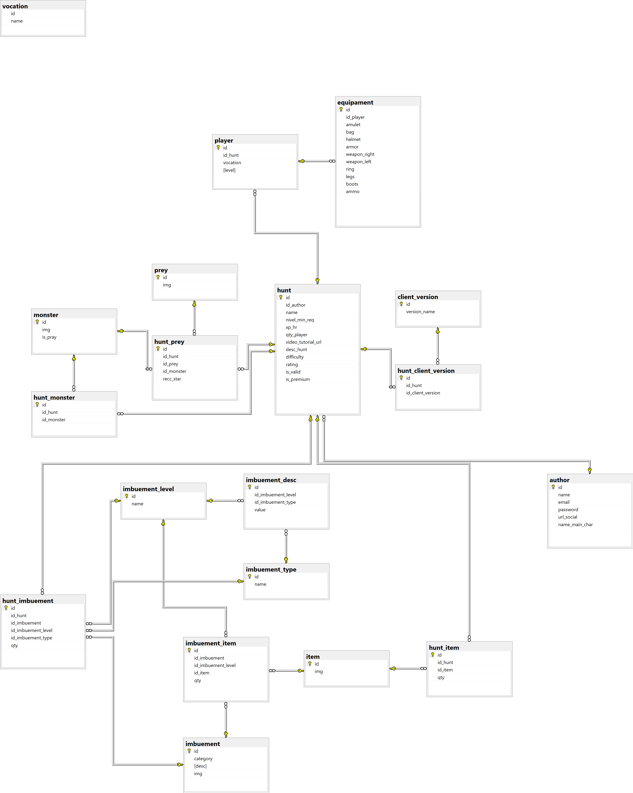

  

- - - -

## Objetivo

Ajudar novos jogadores do jogo Tibia a progredir mais facilmente através da conexão com jogadores experientes
 
## Principais etapas do projeto  

#### Planejamento

- Viabilidade (direitos de imagem)
- Levantamento e análise de requisitos (funcionais e não funcionais)
- Complexidade (aplicação como um todo)
- Custo (hospedagem)
* Tempo necessário (desenvolvimento)

#### Modelagem
##### - Tecnologias utilizadas
- C#,
- ASP.NET Core
- Entity Framework
- Linq
- AutoMapper
- SQL Server
- Azure
- Lucid Chart
- Figma

##### - Arquitetura
- API REST
- Front-End client side (Angular ou Blazor WASM)

##### - Banco de dados
Para o desenvolvimento do diagrama MER foi utilizado o site [Lucid Chart](https://www.lucidchart.com/ "Lucid Chart")

##### - Mockup
Para o desenvolvimento do design foi utilizado o site [Figma](http://https://www.figma.com/ "Figma")

#### Desenvolvimento
##### - Abordagem
Utilizei a abordagem Database First, ou seja, primeiro construiu o banco de dados inteiro para depois partir para a codificação da API

##### - Execução
- Criação das regras de negócio
- Obtenção dos dados (mais de 5000 imagens, informações relevantes) 
  - Foi criado um Web Scraper para a extração e download das imagens.
- Tratamento dos dados (limpeza e padronização)
  - Criado de um programa capaz de aplicar as correções necessárias aos arquivos
- Modelagem dos dados (MER)
- Criação do banco de dados
- Criação da API REST (seguindo padrões recomendados)

## Imagens

### MER
  

### Diagrama SQL Server Management Studio
  

